# Mermaid based Flowchart Symbol Definitions
My take on linking the mermaid node shapes to classic flowchart diagram meanings.

## Action or Process Symbol

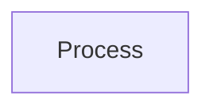

```
flowchart
    id1[Process]
```

A node, default, in mermaid. A box can represent a single step ("add two cups of flour"), or an entire sub-process ("make bread") within a larger process.

## A node with round edges

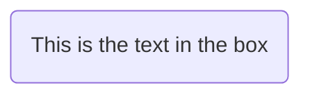

```
flowchart
    id1(This is the text in the box)
```

Nodes with round edges are not defined in classic diagraming language.

## Terminal - Start/End Symbol

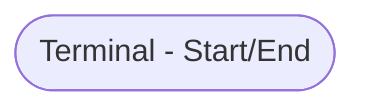

```
flowchart
    id1([Terminal - Start/End])
```

A stadium-shaped node in mermiad. The terminator symbol marks the starting or ending point of the system. It usually contains the word "Start" or "End."

## Subroutine Symbol

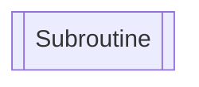

```
flowchart
    id1[[Subroutine]]
```

A node in a subroutine shape in mermaid. Indicates a sequence of actions that perform a specific task embedded within a larger process. This sequence of actions could be described in more detail on a separate flowchart.

## Database Symbol

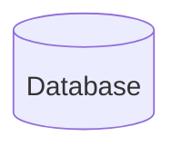

```
flowchart
    id1[(Database)]
```

A node in a cylindrical shape in mermaid. Indicates a list of information with a standard structure that allows for searching and sorting.


## Connector Symbol

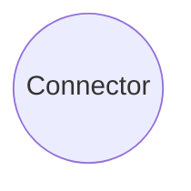

```
flowchart
    id1((Connector))
```

A node in the form of a circle in mermaid. Indicates that the flow continues where a matching symbol (containing the same letter) has been placed.

## A node in an asymmetric shape

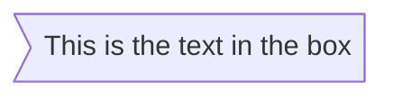

```
flowchart
    id1>This is the text in the box]
```

A node in an asymmetric shape in mermaid. Not defined in classic flowchart diagraming language.

## Decision Symbol

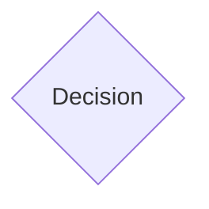

```
flowchart
    id1{Decision}
```

A node (rhombus) in mermaid. A decision or branching point. Lines representing different decisions emerge from different points of the diamond.

## Preparation Symbol

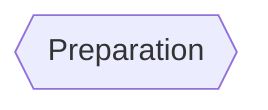

```
flowchart
    id1{{Preparation}}
```

A hexagon node in mermaid. Represents a set-up to another step in the process

## Data - Input/Output Symbol

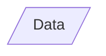

```
flowchart
    id1[/Data/]
```

A parallelogram node in mermaid. Represents material or information entering or leaving the system, such as customer order (input) or a product (output).

## Parallelogram alt

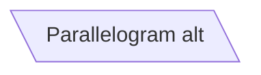

```
flowchart
    id1[\Parallelogram alt\]
```

The left leaning parallelogram node in mermaid. Not defined in classic flowchart diagraming language.

## Trapezoid

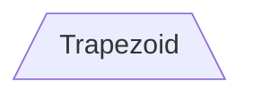

```
flowchart
    id1[/Trapezoid\]
```

The trapezoid node in mermaid. Not defined in classic flowchart diagraming language.

## Manual Loop Symbol

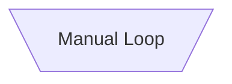

```
flowchart
    id1[\Manual Loop/]
```

The trapizoid alt (downward facing) node in mermaid. Indicates a sequence of commands that will continue to repeat until stopped manually.

## Double Circle

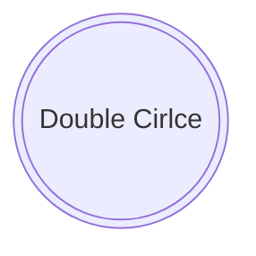

```
flowchart
    id1(((Double Cirlce)))
```

The double circle node in mermaid. Not defined in classic flowchart diagraming language.


## Flowline (Arrowhead) 

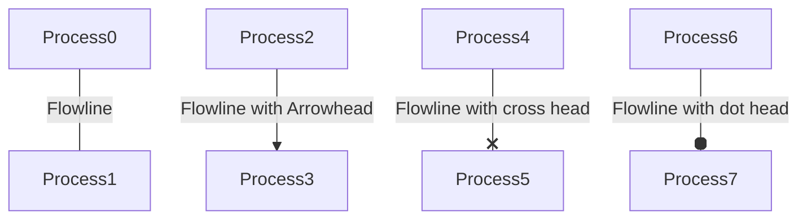

```
flowchart
    Process0 -- Flowline --- Process1
    Process2 -- "Flowline with Arrowhead" --> Process3
    Process4 -- "Flowline with cross head" --x Process5
    Process6 -- "Flowline with dot head" --o Process7
```

A link with arrow head in mermaid. Shows the process's order of operation. A line coming from one symbol and pointing at another. Arrowheads are added if the flow is not the standard top-to-bottom, left-to right. Cross head and dot head are not defined in classic flowcharting language.

## Dotted Line 

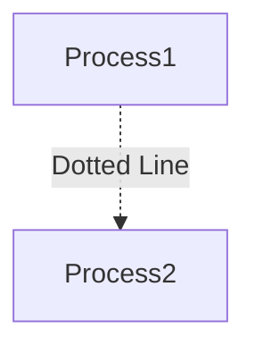

```
flowchart
    Process1 -. Dotted Line .-> Process2
```

A dotted link in mermaid. Dotted lines are not defined in classic flowchart diargaming language.

## Thick Line 

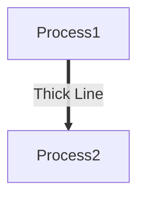

```
flowchart
    Process1 == Thick Line ==> Process2
```

A thick link in mermaid. Dotted lines are not defined in classic flowchart diargaming language.


## Sources

* https://www.smartdraw.com/flowchart/flowchart-symbols.htm
* https://mermaid.js.org/syntax/flowchart.html
* https://en.wikipedia.org/wiki/Flowchart
